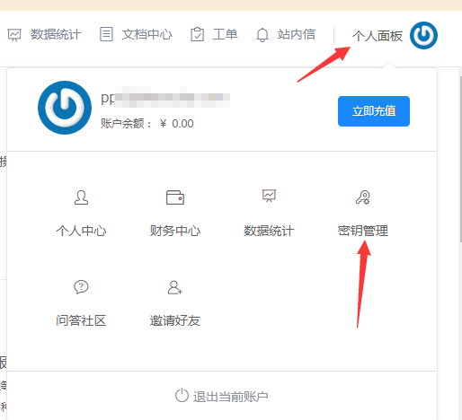

# 设置方法

### 内核2.0.0-beta.1
- 运行入口文件`index.php`
- 页面出现报错
  ```
  [ERROR]Unknown service provider.
  ```
- 入口文件同级目录（根目录）生成`config.inc.php`文件
- 参照下方手册进行设置
- 保存，重新运行

### 内核2.0.0-beta.2或以上
- 运行入口文件`index.php`
- 自动跳转至设置页
- 参照下方手册进行设置
- 保存，重新运行

## 设置项

*加粗为必填项*

|设置项|意义|例子/解释|
|:-:|:-:|:-:|
|**SP**|服务提供商|可选：`QINIU`|
|**AK**|Access Key|账户控制台个人中心密钥管理中提供的AK，参考下方`图2`|
|**SK**|Secret Key|账户控制台个人中心密钥管理中提供的SK，参考下方`图2`|
|**BKT**|Bucket|需要连接的对象存储Bucket名称|
|**DM**|Domain|Bucket提供的域名或自行绑定的域名，一般为`xxx.com`，参考下方`图1`|
|AA|Account Authenticated|账户是否实名，实名填写`true`,否则填写`false`（此项设置不需要使用双引号）|
|QD|Query Doamin|查询已使用的流量时需要查询的域名，多个域名时使用英文逗号隔开|
|*update_basic_url*|升级服务器地址|此处请参考[官方升级文档](./update.md)设置或保持默认|

---

## 举个栗子

### 配置文件
```
配置实例，仅供参考
<?php
$config=array (
  'SP' => 'qiniu',
  'AK' => 'J7YjcNP4Ko4HC5Q7szrX6EGxL8e2T06mqDgRVCqJ',
  'SK' => '4woy6x8Y9y5GZtc_WGG73fSzx8qNaxjiRfPwKEBp',
  'BKT' => 'example',
  'DM' => "osciu32fu.bkt.clouddn.com",
  'AA' => false,
  'QD' => "osciu32fu.bkt.clouddn.com",
  'update_basic_url' => '//pc.twocola.com/',
);
```

---

**下图操作均在`管理控制台`中**

**图1**


**图2**



---

## 自助更新

- 打开站点
- 站点底部版本号区域若存在新版本会提示更新
