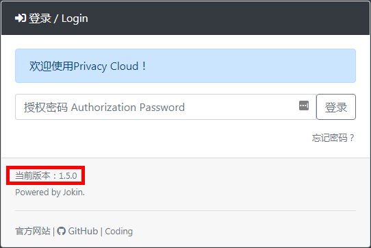
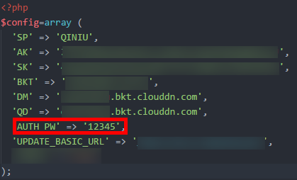

# 忘记密码

## 找回密码

- 观察登录页所示`当前版本`（如下图红色指出）

- 找到下方对应版本进行操作

## v1.5及以下版本

- 打开程序根目录下的`config.inc.php`文件
- 找到 `AUTH_PW` => `密码`（如下图密码为`12345`）

- 建议使用原密码登录后进入`配置页`修改密码，**不建议** 修改文件

---

Privacy Cloud 维运团队
